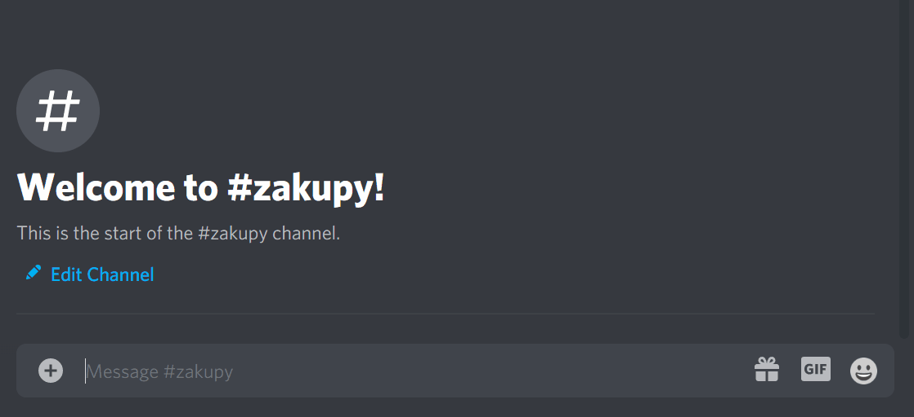

# Shopping list BOT for Discord!

BOT written in Rust language, allows your server to create common shopping list for everybody to organize perfect Barbecue! It can work on many servers (each server has its own shopping list)! More barbecues! 

# Installation
## Prequisites
1) Rust compiler.
2) In order to run discord BOT on your server, you have to create BOT on Discord Developer portal.
3) Place the token of your bot in token.json file with the following structure:

```json
{
    "token": "place your token string here"
}
```

4) Invite bot to your server with this link: https://discord.com/oauth2/authorize?client_id=XXX&scope=bot where XXX is your BOT's application Client ID

## Compilation
If you want to run it on desktop, then just `cargo run`. If you want the bot to run on your old android phone, then you have to use `cargo ndk` and specify platform and target of your build. ex.: `cargo ndk --platform 21 --target armv7-linux-androideabi build`. Also, don't forget about putting token.json file in the same folder as the built binary.

## Usage
If you have more bot's on server, you can reduce the scope of the bot to one channel with server roles, so that the commands do not collide.

* `!help` displays help
* `!shop new` creates a new list
* `-item name` adds the "item name" to the list.
* `!bought 1` removes the first item on the list, `!bought 2` removes the second one, etc.


## Demo
Creating new list:


